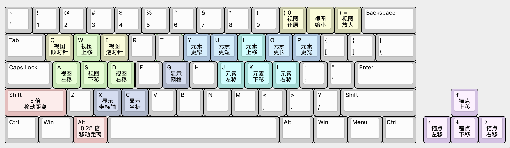

# Irminsul Client

## 构建

本项目使用 SvelteKit 与 TypeScript。

需要安装 [Node.js](https://nodejs.org/)。

```sh
npm install # 安装依赖
npm run build # 生成网页
```

结果将位于 `build` 文件夹内。

## 关系图

对于关系图中的所有元素，都可以进行修改。操作方法如下图所示：



其中，Atom 只可以进行移动。Cluster 除了可以移动之外，还可以调整长度、宽度和锚点的位置。

修改完毕之后，可以将位置导出为 JSON 或 本项目内使用的 Haskell 格式。JSON 用于在网页中导入，Haskell 则可直接用于 Cluster 的 RelationGraphLayout。
